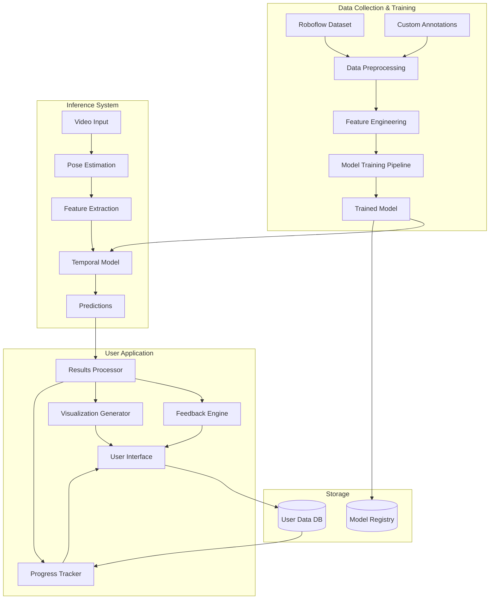

# Design Document

## Overview

The Vertical Jump Coach is an ML-powered digital coaching system that analyzes vertical jump performance from video input. The system consists of three major subsystems: (1) an ML training pipeline that processes annotated video datasets to create prediction models, (2) an inference engine that analyzes new jump videos in real-time or post-session, and (3) a user-facing application that delivers performance metrics, technique feedback, and personalized training recommendations.

The architecture emphasizes modularity, allowing the ML model to be retrained and updated independently of the user interface. The system is designed for deployment on mobile devices with cloud-based model training infrastructure.

## Architecture

### High-Level System Architecture



### Technology Stack Recommendations

**ML Training Infrastructure:**
- Python 3.9+ for training pipeline
- PyTorch or TensorFlow for model development
- MediaPipe or OpenPose for pose estimation
- Roboflow API for dataset access
- MLflow for experiment tracking
- AWS S3 or similar for dataset storage

**Inference Engine:**
- TensorFlow Lite or PyTorch Mobile for on-device inference
- ONNX Runtime for cross-platform model deployment
- OpenCV for video processing

**User Application:**
- React Native or Flutter for cross-platform mobile development
- TypeScript for type safety
- SQLite for local data storage
- REST API for cloud synchronization

**Backend Services:**
- Node.js or Python FastAPI for API services
- PostgreSQL for user data and analytics
- Redis for caching
- AWS Lambda or similar for serverless model inference (optional cloud mode)

## Components and Interfaces

### 1. Data Preprocessing Module

**Responsibility:** Load, validate, and prepare training videos with annotations.

**Interfaces:**
```typescript
interface VideoAnnotation {
  videoId: string;
  frames: {
    jumpStart: number;
    takeoff: number;
    peak: number;
    landing: number;
  };
  joints: {
    frameNumber: number;
    leftAnkle: Point2D;
    rightAnkle: Point2D;
    leftKnee: Point2D;
    rightKnee: Point2D;
    leftHip: Point2D;
    rightHip: Point2D;
    torso: Point2D;
  }[];
  metadata: {
    environment: 'indoor' | 'outdoor';
    surface: 'wood' | 'rubber' | 'turf';
    cameraAngle: 'front' | 'side' | '45deg';
    userType: 'male' | 'female';
    skillLevel: 'beginner' | 'intermediate' | 'elite';
  };
}

interface DataPreprocessor {
  loadFromRoboflow(apiKey: string, datasetId: string): Promise<VideoAnnotation[]>;
  validateAnnotations(annotations: VideoAnnotation[]): ValidationResult;
  splitDataset(annotations: VideoAnnotation[], testRatio: number): {
    train: VideoAnnotation[];
    test: VideoAnnotation[];
  };
}
```

### 2. Feature Engineering Module

**Responsibility:** Extract biomechanical features from pose estimation data.

**Interfaces:**
```typescript
interface BiomechanicalFeatures {
  // Angular measurements (degrees)
  kneeFlexionAngle: { left: number; right: number };
  hipHingeDepth: number;
  anklePlantarFlexion: { left: number; right: number };
  torsoAlignment: number; // degrees from vertical
  
  // Temporal measurements
  armSwingTiming: number; // milliseconds
  groundContactTime: number; // milliseconds
  
  // Kinematic measurements
  centerOfMassTrajectory: Point2D[];
  takeoffVelocity: number; // m/s
  
  // Symmetry measurements
  leftRightSymmetry: number; // 0-1 score
}

interface FeatureExtractor {
  extractFromPose(poseSequence: PoseKeypoints[]): BiomechanicalFeatures;
  calculateAngles(joint1: Point2D, joint2: Point2D, joint3: Point2D): number;
  computeCenterOfMass(poseKeypoints: PoseKeypoints): Point2D;
  detectPhases(poseSequence: PoseKeypoints[]): JumpPhases;
}

interface JumpPhases {
  setup: { startFrame: number; endFrame: number };
  takeoff: { startFrame: number; endFrame: number };
  peak: { startFrame: number; endFrame: number };
  landing: { startFrame: number; endFrame: number };
}
```

### 3. ML Model Module

**Responsibility:** Temporal model that predicts jump metrics and classifies errors.

**Architecture:**
- Input: Sequence of biomechanical features (variable length)
- Temporal Layer: LSTM with 128 hidden units, 2 layers
- Regression Head: Fully connected layers → jump height, quality score, phase timing
- Classification Head: Fully connected layers → softmax over error types

**Interfaces:**
```typescript
interface ModelPredictions {
  jumpHeight: number; // cm
  qualityScore: number; // 0-100
  phaseTiming: {
    setup: number; // ms
    takeoff: number;
    flight: number;
    landing: number;
  };
  errors: TechniqueError[];
  confidence: number; // 0-1
}

interface TechniqueError {
  type: 'poor_depth' | 'early_arm_swing' | 'knee_valgus' | 'forward_lean' | 'stiff_landing';
  severity: 'low' | 'medium' | 'high';
  confidence: number;
}

interface JumpModel {
  train(features: BiomechanicalFeatures[], labels: JumpLabels[]): TrainingResult;
  predict(features: BiomechanicalFeatures): ModelPredictions;
  evaluate(testData: { features: BiomechanicalFeatures; labels: JumpLabels }[]): EvaluationMetrics;
  saveModel(path: string): void;
  loadModel(path: string): void;
}
```

### 4. Pose Estimation Module

**Responsibility:** Detect human body keypoints from video frames.

**Interfaces:**
```typescript
interface PoseKeypoints {
  frameNumber: number;
  timestamp: number; // milliseconds
  keypoints: {
    nose: Point3D;
    leftEye: Point3D;
    rightEye: Point3D;
    leftEar: Point3D;
    rightEar: Point3D;
    leftShoulder: Point3D;
    rightShoulder: Point3D;
    leftElbow: Point3D;
    rightElbow: Point3D;
    leftWrist: Point3D;
    rightWrist: Point3D;
    leftHip: Point3D;
    rightHip: Point3D;
    leftKnee: Point3D;
    rightKnee: Point3D;
    leftAnkle: Point3D;
    rightAnkle: Point3D;
  };
  confidence: number; // overall pose confidence
}

interface Point3D {
  x: number;
  y: number;
  z: number;
  confidence: number;
}

interface PoseEstimator {
  processVideo(videoPath: string): Promise<PoseKeypoints[]>;
  processFrame(frame: ImageData): PoseKeypoints;
  getConfidence(): number;
}
```

### 5. Feedback Engine Module

**Responsibility:** Convert model predictions into actionable coaching feedback.

**Interfaces:**
```typescript
interface CoachingFeedback {
  summary: string;
  positives: string[]; // max 2
  improvements: string[]; // max 3
  detailedExplanation: string;
  exerciseRecommendations: Exercise[];
}

interface Exercise {
  name: string;
  description: string;
  targetArea: string;
  difficulty: 'beginner' | 'intermediate' | 'advanced';
  videoUrl?: string;
}

interface FeedbackEngine {
  generateFeedback(
    predictions: ModelPredictions,
    userProfile: UserProfile,
    mode: 'realtime' | 'post_jump'
  ): CoachingFeedback;
  generateAudioCue(error: TechniqueError): string;
  prioritizeCorrections(errors: TechniqueError[]): TechniqueError[];
}
```

### 6. Visualization Generator Module

**Responsibility:** Create visual representations of jump analysis.

**Interfaces:**
```typescript
interface JumpVisualization {
  skeletonOverlay: VideoFrame[];
  centerOfMassTrajectory: Point2D[];
  phaseMarkers: {
    phase: string;
    frameNumber: number;
    color: string;
  }[];
  symmetryChart: {
    leftLeg: number[];
    rightLeg: number[];
    timestamps: number[];
  };
}

interface VisualizationGenerator {
  generateSkeletonOverlay(
    video: VideoData,
    poseSequence: PoseKeypoints[]
  ): VideoFrame[];
  drawCenterOfMass(
    frames: VideoFrame[],
    trajectory: Point2D[]
  ): VideoFrame[];
  createSymmetryVisualization(
    leftLegData: number[],
    rightLegData: number[]
  ): ChartData;
  highlightPhases(
    frames: VideoFrame[],
    phases: JumpPhases
  ): VideoFrame[];
}
```

### 7. Progress Tracker Module

**Responsibility:** Store and analyze user performance over time.

**Interfaces:**
```typescript
interface UserProfile {
  userId: string;
  age: number;
  gender: 'male' | 'female' | 'other';
  height: number; // cm
  weight: number; // kg
  skillLevel: 'beginner' | 'intermediate' | 'advanced' | 'elite';
  trainingGoal: 'increase_height' | 'landing_safety' | 'speed_reactivity';
  safetyMode: 'standard' | 'knee_safe' | 'rehab';
}

interface JumpSession {
  sessionId: string;
  userId: string;
  timestamp: Date;
  jumps: JumpRecord[];
  averageHeight: number;
  bestHeight: number;
  consistencyScore: number;
  fatigueIndicator: number; // 0-1
}

interface JumpRecord {
  jumpId: string;
  sessionId: string;
  timestamp: Date;
  predictions: ModelPredictions;
  videoPath: string;
  feedback: CoachingFeedback;
}

interface ProgressTracker {
  saveJump(userId: string, jump: JumpRecord): Promise<void>;
  getSessionHistory(userId: string, limit: number): Promise<JumpSession[]>;
  calculateProgress(userId: string, timeRange: TimeRange): ProgressMetrics;
  detectFatigue(session: JumpSession): number;
  getBenchmarks(userProfile: UserProfile): Benchmarks;
}

interface ProgressMetrics {
  heightImprovement: number; // percentage
  consistencyTrend: 'improving' | 'stable' | 'declining';
  errorReduction: { [errorType: string]: number };
  streakDays: number;
}

interface Benchmarks {
  personalBest: number;
  ageGroupAverage: number;
  ageGroupTop10: number;
  sportPositionAverage?: number;
}
```

### 8. User Interface Module

**Responsibility:** Present information and handle user interactions.

**Key Screens:**
1. **Home Screen:** One-tap jump recording, quick stats
2. **Recording Screen:** Real-time audio cues, minimal UI
3. **Results Screen:** Performance cards, visual breakdown
4. **Feedback Screen:** Coaching tips, exercise recommendations
5. **Progress Screen:** Charts, benchmarks, achievements
6. **Settings Screen:** Profile, goals, safety modes

**Interfaces:**
```typescript
interface UIController {
  startJumpRecording(): Promise<void>;
  stopJumpRecording(): Promise<VideoData>;
  displayResults(predictions: ModelPredictions, visualization: JumpVisualization): void;
  displayFeedback(feedback: CoachingFeedback): void;
  displayProgress(metrics: ProgressMetrics, benchmarks: Benchmarks): void;
  playAudioCue(cue: string): void;
  showConfidenceExplanation(confidence: number, factors: string[]): void;
}
```

## Data Models

### Database Schema

**Users Table:**
```sql
CREATE TABLE users (
  user_id UUID PRIMARY KEY,
  email VARCHAR(255) UNIQUE NOT NULL,
  created_at TIMESTAMP DEFAULT NOW(),
  age INTEGER,
  gender VARCHAR(20),
  height_cm DECIMAL(5,2),
  weight_kg DECIMAL(5,2),
  skill_level VARCHAR(20),
  training_goal VARCHAR(50),
  safety_mode VARCHAR(20)
);
```

**Jump Sessions Table:**
```sql
CREATE TABLE jump_sessions (
  session_id UUID PRIMARY KEY,
  user_id UUID REFERENCES users(user_id),
  session_date TIMESTAMP DEFAULT NOW(),
  average_height DECIMAL(5,2),
  best_height DECIMAL(5,2),
  consistency_score DECIMAL(3,2),
  fatigue_indicator DECIMAL(3,2),
  total_jumps INTEGER
);
```

**Jump Records Table:**
```sql
CREATE TABLE jump_records (
  jump_id UUID PRIMARY KEY,
  session_id UUID REFERENCES jump_sessions(session_id),
  user_id UUID REFERENCES users(user_id),
  jump_timestamp TIMESTAMP DEFAULT NOW(),
  video_path VARCHAR(500),
  jump_height DECIMAL(5,2),
  quality_score DECIMAL(5,2),
  confidence DECIMAL(3,2),
  predictions_json JSONB,
  feedback_json JSONB
);
```

**Achievements Table:**
```sql
CREATE TABLE achievements (
  achievement_id UUID PRIMARY KEY,
  user_id UUID REFERENCES users(user_id),
  achievement_type VARCHAR(50),
  achievement_name VARCHAR(100),
  earned_at TIMESTAMP DEFAULT NOW(),
  value DECIMAL(10,2)
);
```

### Model Artifacts

**Trained Model Package:**
```
model_v1.0/
├── model.onnx              # Exported model
├── metadata.json           # Model version, training date, metrics
├── feature_config.json     # Feature extraction parameters
├── label_encodings.json    # Error type mappings
└── normalization_params.json  # Feature scaling parameters
```

## Data Models

### Training Data Format

**Video Annotation JSON:**
```json
{
  "video_id": "jump_001",
  "video_path": "s3://bucket/videos/jump_001.mp4",
  "fps": 30,
  "duration_ms": 2000,
  "frames": {
    "jump_start": 15,
    "takeoff": 45,
    "peak": 75,
    "landing": 105
  },
  "joints": [
    {
      "frame_number": 15,
      "left_ankle": {"x": 120, "y": 450},
      "right_ankle": {"x": 180, "y": 450},
      "left_knee": {"x": 115, "y": 350},
      "right_knee": {"x": 185, "y": 350},
      "left_hip": {"x": 110, "y": 250},
      "right_hip": {"x": 190, "y": 250},
      "torso_center": {"x": 150, "y": 200}
    }
  ],
  "labels": {
    "jump_height_cm": 45.5,
    "quality_score": 82,
    "errors": ["knee_valgus"],
    "phase_durations_ms": {
      "setup": 500,
      "takeoff": 200,
      "flight": 600,
      "landing": 300
    }
  },
  "metadata": {
    "environment": "indoor",
    "surface": "wood",
    "camera_angle": "side",
    "user_gender": "male",
    "user_height_cm": 180,
    "skill_level": "intermediate"
  }
}
```


## Correctness Properties

*A property is a characteristic or behavior that should hold true across all valid executions of a system—essentially, a formal statement about what the system should do. Properties serve as the bridge between human-readable specifications and machine-verifiable correctness guarantees.*

### Property 1: Dataset diversity coverage
*For any* loaded training dataset, it should contain videos from all required categories: indoor and outdoor environments, wood/rubber/turf surfaces, front/side/45-degree camera angles, and male/female/beginner/elite user types.
**Validates: Requirements 1.2, 1.3, 1.4**

### Property 2: Phase annotation completeness
*For any* video annotation accepted by the system, it should contain all four required phase frame markers: jump start, takeoff, peak, and landing.
**Validates: Requirements 2.1**

### Property 3: Joint annotation completeness
*For any* labeled frame in a video annotation, it should contain joint position data for all required joints: left and right ankles, knees, hips, and torso center.
**Validates: Requirements 2.2**

### Property 4: Complete feature extraction
*For any* valid pose sequence, the feature extractor should produce all required measurements: angular features (knee flexion, hip hinge, ankle flexion, torso alignment), temporal features (arm swing timing, ground contact time), kinematic features (COM trajectory, takeoff velocity), and symmetry measurements.
**Validates: Requirements 3.1, 3.2, 3.3**

### Property 5: Confidence reduction on extraction failure
*For any* feature extraction process where one or more measurements fail, the resulting confidence score should be lower than if all extractions succeeded.
**Validates: Requirements 3.4**

### Property 6: Complete model predictions
*For any* valid feature input to the trained model, the output should include all required predictions: jump height, quality score, phase timing for all phases, and error classifications.
**Validates: Requirements 4.1, 4.2, 4.3, 4.4**

### Property 7: Dual output optimization
*For any* trained model, it should produce both regression outputs (continuous metrics like height) and classification outputs (categorical error types).
**Validates: Requirements 5.3**

### Property 8: Athlete-level data separation
*For any* train/test split of the dataset, no athlete ID should appear in both the training set and the test set.
**Validates: Requirements 6.1**

### Property 9: MAE calculation completeness
*For any* model evaluation on a test set, Mean Absolute Error should be calculated for jump height predictions.
**Validates: Requirements 6.2**

### Property 10: Complete results display
*For any* completed jump analysis, the results should include jump height in both centimeters and inches, plus all core metrics: power score, explosiveness rating, takeoff efficiency, and landing control score.
**Validates: Requirements 7.1, 7.2**

### Property 11: Complete visualization generation
*For any* jump with valid pose and feature data, the visualization should include all required elements: frame-by-frame phase breakdown for all four phases, skeleton overlay, center of mass trajectory, and left-right symmetry comparison.
**Validates: Requirements 8.1, 8.2, 8.3, 8.4**

### Property 12: Feedback includes actionable instructions
*For any* detected technique error, the generated coaching feedback should include specific fix instructions describing how to correct the error.
**Validates: Requirements 9.1**

### Property 13: Correction limit enforcement
*For any* generated feedback session, the number of correction items should not exceed 3.
**Validates: Requirements 9.2**

### Property 14: Positive-first feedback ordering
*For any* feedback that contains both positive reinforcement and corrections, the positive items should appear before the correction items in the output.
**Validates: Requirements 9.3**

### Property 15: Cross-mode measurement consistency
*For any* jump analyzed in both real-time and post-jump modes, the core measurements (jump height, phase timing, detected errors) should be identical between modes.
**Validates: Requirements 10.3**

### Property 16: Training goal validation
*For any* user-selected training goal, it should be one of the supported goal types: increase height, improve landing safety, or speed and reactivity.
**Validates: Requirements 11.1**

### Property 17: Exercise recommendation generation
*For any* identified technique deficiency, the system should recommend at least one exercise from the defined categories: squats, plyometrics, or mobility drills.
**Validates: Requirements 11.2**

### Property 18: Personalized recommendations
*For any* two users with the same detected error but different skill levels, the exercise recommendations should differ to match their respective skill levels.
**Validates: Requirements 11.3**

### Property 19: Session aggregate metrics
*For any* jump session containing multiple jumps, the system should calculate all three aggregate metrics: best jump height, average jump height, and consistency score.
**Validates: Requirements 12.1**

### Property 20: Fatigue detection execution
*For any* user with multiple recorded sessions, the system should calculate fatigue indicators when analyzing patterns over time.
**Validates: Requirements 12.2**

### Property 21: Progress comparison completeness
*For any* progress display, it should include comparisons against all required benchmarks: previous self and age group norms (sport position is optional).
**Validates: Requirements 12.3**

### Property 22: Streak calculation accuracy
*For any* user activity history, if jumps are recorded on consecutive days, the streak counter should increment correctly, and if a day is missed, the streak should reset to zero.
**Validates: Requirements 13.1**

### Property 23: Milestone badge awarding
*For any* user achievement that matches a defined milestone (e.g., reaching 30cm jump height), the appropriate badge should be awarded exactly once.
**Validates: Requirements 13.2**

### Property 24: Confidence score inclusion
*For any* prediction output displayed to the user, it should include a confidence score expressed as a percentage.
**Validates: Requirements 14.1**

### Property 25: Confidence explanation availability
*For any* displayed confidence score, an explanation of the score should be available when requested by the user.
**Validates: Requirements 14.2**

### Property 26: Low confidence triggers tips
*For any* prediction with confidence below 80%, the system should provide camera positioning tips to the user.
**Validates: Requirements 14.4**

### Property 27: Safety mode recommendation adjustment
*For any* user in knee-safe or rehab mode, the exercise recommendations should differ from standard mode recommendations for the same detected errors, prioritizing joint protection and rehabilitation protocols respectively.
**Validates: Requirements 15.1, 15.2**

### Property 28: Risky pattern warning generation
*For any* detected risky landing pattern (e.g., severe knee valgus, extremely stiff landing), the system should generate and display a warning alert.
**Validates: Requirements 15.3**

## Error Handling

### Video Processing Errors

**Scenario:** Video file is corrupted or unreadable
- **Handling:** Catch exception, log error details, return user-friendly message: "Unable to process video. Please try recording again."
- **Recovery:** Allow user to re-record immediately

**Scenario:** Pose estimation fails (person not visible, poor lighting)
- **Handling:** Return low confidence score (<50%), provide specific feedback about what went wrong
- **Recovery:** Show camera positioning tips, suggest better lighting

**Scenario:** Video too short or too long
- **Handling:** Validate video duration (expected 1-3 seconds for a jump), reject with specific message
- **Recovery:** Provide guidance on proper recording timing

### Feature Extraction Errors

**Scenario:** Missing keypoints in critical frames
- **Handling:** Attempt interpolation for missing frames, reduce confidence score proportionally
- **Recovery:** If too many frames missing, reject analysis and request re-recording

**Scenario:** Impossible biomechanical values (e.g., knee angle >180°)
- **Handling:** Flag as anomaly, apply bounds checking, reduce confidence
- **Recovery:** Log for model improvement, still provide best-effort analysis

### Model Prediction Errors

**Scenario:** Model inference fails
- **Handling:** Catch exception, log full error trace, return graceful error to user
- **Recovery:** Retry once, if fails again, suggest app restart or report issue

**Scenario:** Prediction values out of reasonable range
- **Handling:** Apply sanity checks (e.g., jump height 0-150cm), clip to valid range, reduce confidence
- **Recovery:** Flag for review, still display results with low confidence indicator

### Data Storage Errors

**Scenario:** Database write fails
- **Handling:** Retry with exponential backoff (3 attempts), cache locally if all fail
- **Recovery:** Sync when connection restored, notify user of temporary offline mode

**Scenario:** Storage quota exceeded
- **Handling:** Detect before write, prompt user to delete old sessions or upgrade storage
- **Recovery:** Provide storage management UI

### Network Errors

**Scenario:** Cloud sync fails
- **Handling:** Queue operations locally, retry in background
- **Recovery:** Show offline indicator, sync when connection restored

**Scenario:** Model download fails (for updates)
- **Handling:** Continue using cached model, retry download in background
- **Recovery:** Notify user when update available

### User Input Errors

**Scenario:** Invalid profile data (e.g., negative height)
- **Handling:** Validate on input, show inline error messages
- **Recovery:** Prevent submission until corrected

**Scenario:** Conflicting safety modes selected
- **Handling:** Enforce mutual exclusivity in UI, default to most conservative mode
- **Recovery:** Explain mode differences to user

## Testing Strategy

### Unit Testing Approach

Unit tests will verify specific functionality of individual components and modules. Focus areas include:

**Data Preprocessing:**
- Test loading annotations from different formats (JSON, Roboflow API response)
- Test validation rejection of incomplete annotations
- Test dataset splitting maintains athlete separation
- Example: Verify that annotation with missing "landing" frame is rejected

**Feature Extraction:**
- Test angle calculation with known joint positions
- Test center of mass calculation with sample pose data
- Test symmetry calculation with asymmetric poses
- Example: Given joints at specific coordinates, verify knee angle calculation is correct

**Model Interface:**
- Test model input/output shapes and types
- Test prediction bounds checking
- Test confidence score calculation
- Example: Verify model rejects feature vectors with wrong dimensions

**Feedback Generation:**
- Test correction limiting (max 3)
- Test positive-first ordering
- Test exercise recommendation mapping
- Example: Given 5 detected errors, verify only top 3 appear in feedback

**Progress Tracking:**
- Test streak calculation with various activity patterns
- Test benchmark comparisons
- Test fatigue detection logic
- Example: Verify streak resets after missed day

**Visualization:**
- Test skeleton overlay generation
- Test trajectory line drawing
- Test phase marker placement
- Example: Verify skeleton connects correct keypoints

### Property-Based Testing Approach

Property-based tests will verify universal properties across many randomly generated inputs using a PBT library. We will use **Hypothesis** for Python components and **fast-check** for TypeScript components.

**Configuration:**
- Each property test MUST run a minimum of 100 iterations
- Each property test MUST include a comment tag referencing the design document property
- Tag format: `# Feature: vertical-jump-coach, Property {number}: {property_text}`

**Key Properties to Test:**

**Property 1: Dataset diversity coverage**
- Generate random datasets with varying compositions
- Verify all required categories are present
- Tag: `# Feature: vertical-jump-coach, Property 1: Dataset diversity coverage`

**Property 2 & 3: Annotation completeness**
- Generate random annotations with missing fields
- Verify validation correctly accepts/rejects
- Tag: `# Feature: vertical-jump-coach, Property 2: Phase annotation completeness`

**Property 4: Complete feature extraction**
- Generate random valid pose sequences
- Verify all feature fields are populated
- Tag: `# Feature: vertical-jump-coach, Property 4: Complete feature extraction`

**Property 5: Confidence reduction on failure**
- Generate scenarios with varying numbers of extraction failures
- Verify confidence decreases monotonically with more failures
- Tag: `# Feature: vertical-jump-coach, Property 5: Confidence reduction on extraction failure`

**Property 8: Athlete-level data separation**
- Generate random datasets with athlete IDs
- Verify no ID appears in both train and test after split
- Tag: `# Feature: vertical-jump-coach, Property 8: Athlete-level data separation`

**Property 13: Correction limit enforcement**
- Generate random error lists of varying sizes
- Verify output never exceeds 3 corrections
- Tag: `# Feature: vertical-jump-coach, Property 13: Correction limit enforcement`

**Property 14: Positive-first feedback ordering**
- Generate random feedback with positives and corrections
- Verify all positives appear before all corrections
- Tag: `# Feature: vertical-jump-coach, Property 14: Positive-first feedback ordering`

**Property 15: Cross-mode measurement consistency**
- Generate random jump data
- Analyze in both modes, verify core metrics match
- Tag: `# Feature: vertical-jump-coach, Property 15: Cross-mode measurement consistency`

**Property 18: Personalized recommendations**
- Generate pairs of users with same error, different skill levels
- Verify recommendations differ
- Tag: `# Feature: vertical-jump-coach, Property 18: Personalized recommendations`

**Property 22: Streak calculation accuracy**
- Generate random activity histories with gaps
- Verify streak calculation follows rules
- Tag: `# Feature: vertical-jump-coach, Property 22: Streak calculation accuracy`

**Property 27: Safety mode recommendation adjustment**
- Generate random errors and user profiles with different safety modes
- Verify recommendations differ appropriately by mode
- Tag: `# Feature: vertical-jump-coach, Property 27: Safety mode recommendation adjustment`

### Integration Testing

Integration tests will verify component interactions:

- **End-to-end video processing:** Video → Pose → Features → Model → Results
- **Database operations:** Save jump → Retrieve history → Calculate progress
- **UI workflows:** Record → Analyze → Display → Navigate to progress
- **External integrations:** Roboflow API data loading, cloud sync

### Test Data Strategy

**Synthetic Data:**
- Generate programmatic pose sequences for feature extraction tests
- Create mock annotations for validation tests
- Use deterministic random seeds for reproducibility

**Real Data:**
- Maintain small set of real jump videos for integration tests
- Include edge cases: poor lighting, partial occlusion, unusual body types
- Annotate manually for ground truth

**Roboflow Data:**
- Use subset of Roboflow dataset for model training validation
- Keep separate holdout set never used in training

### Performance Testing

- **Inference latency:** Model prediction should complete in <500ms on target devices
- **Video processing:** Full analysis should complete in <5 seconds for 2-second video
- **UI responsiveness:** All interactions should respond in <100ms

### Continuous Testing

- Run unit tests on every commit
- Run property tests nightly (due to longer execution time)
- Run integration tests before releases
- Monitor model performance metrics in production

